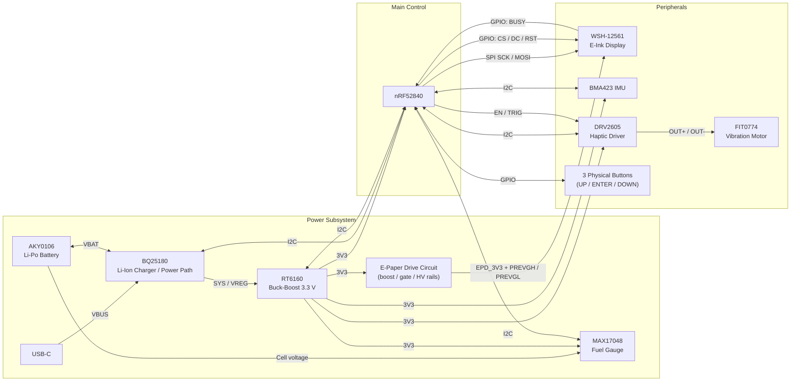

# InkTime Smartwatch

InkTime is a custom, open source smartwatch based on Nordic nRF52840, designed to have a low power consumption. It features an E-Ink display, 3-axis accelerometer, haptic feedback, and a 3 button navigation system.

## System Architecture Diagram

## Hardware Functionality
The nRF52840 is the central controller of the InkTime smartwatch. It runs the firmware, decides when to sleep and wake up, reads sensors, updates the display, handles the buttons, and manages communication with the other chips.

Around the MCU, there are five smaller systems that work together to create a fully functional smartwatch.

The power system is responsible for providing clean power used to charge and operate the watch.

- USB-C brings power from the charger,
- BQ25180 charges the battery and manages the power flow,
- AKY0106 is the battery itself,
- RT6160 generates the regulated 3.3 V rail,
- MAX17048 monitors the battery status and indicates how full it is.

The display system is the bridge between the internal data and the actual information the user sees. Unlike LCD or OLED panels, it does not need continuous power to hold an image, because the ink particles remain in the same position. Therefore, power is mainly used only when the image is changed or refreshed, making it well suited for this use case.

The motion system helps the smartwatch stay in a low-power state by using IMU data, allowing the watch to wake up only when a specific motion occurs, for example a tilt.

The haptic system is based on the DRV2605 haptic driver. Its role is to give the smartwatch user physical feedback through vibration, for example when a notification appears, an alarm is triggered, or a button press is confirmed.

The user input system is formed by three physical buttons: SW_UP, SW_ENT, and SW_DW. These buttons allow the user to interact with the smartwatch in a simple and reliable way.

Power Profile Estimate
- the nRF52840 stays in deep sleep most of the time, below 10 µA,
- the watch wakes once per minute,
- the E-Ink display is refreshed for about 1–2 s,
- active current during refresh is around 8–10 mA.

## nRF52840 Pin Allocation
| Peripheral       | Pin(s)        | Function     | Justification                                 |
| ---------------- | ------------- | ------------ | --------------------------------------------- |
| SPI SCK          | P0.02         | Clock        | SPI clock for the E-Ink display.              |
| SPI MOSI         | P0.03         | Data         | Sends pixel data to the E-Ink display.        |
| EPD CS           | P0.05         | Chip Select  | Selects the display on the SPI bus.           |
| I2C SDA          | P0.06         | Data         | Shared data line for sensors and power ICs.   |
| I2C SCL          | P0.07         | Clock        | Shared clock line for the I2C bus.            |
| IMU INT1         | P0.08         | Interrupt    | Main interrupt from the IMU.                  |
| Fuel Gauge ALERT | P0.09         | Interrupt    | Battery alert signal from MAX17048.           |
| PMIC INT         | P0.11         | Interrupt    | Status or fault signal from BQ25180.          |
| HAPTIC_EN        | P0.12         | Control      | Controls the haptic driver.                   |
| Button UP        | P0.13         | GPIO Input   | Reads the UP button state.                    |
| Button ENTER     | P0.14         | GPIO Input   | Reads the ENTER button state.                 |
| EPD DC           | P0.15         | Control      | Selects command or data mode for the display. |
| EPD RST          | P0.16         | Control      | Resets the E-Ink display.                     |
| EPD BUSY         | P0.17         | Status Input | Shows when the display is busy refreshing.    |
| nRESET           | P0.18 / RESET | Reset        | Resets the MCU.                               |
| Button DOWN      | P1.02         | GPIO Input   | Reads the DOWN button state.                  |
| IMU INT2         | P1.08         | Interrupt    | Secondary interrupt from the IMU.             |
| USB D+           | D+            | USB Data     | USB communication line.                       |
| USB D-           | D-            | USB Data     | USB communication line.                       |
| SWDIO            | SWDIO         | Debug        | Debug and programming data line.              |
| SWDCLK           | SWDCLK        | Debug        | Debug and programming clock line.             |

## Bill of Materials (BOM)
| Qty | Value             | Parts                                                                     | Device                              | Package                      | Product Link                                                                        | Datasheet Link                                                                                                                                   |
| --: | ----------------- | ------------------------------------------------------------------------- | ----------------------------------- | ---------------------------- | ----------------------------------------------------------------------------------- | ------------------------------------------------------------------------------------------------------------------------------------------------ |
|   1 | nRF52840-QIAA     | U1                                                                        | NORDIC_NRF_4_NRF52840_QF            | AQFN-73-EP(7x7)              | [JLCPCB](https://jlcpcb.com/partdetail/NordicSemicon-NRF52840_QIAAR/C190794)        | [Datasheet](https://infocenter.nordicsemi.com/pdf/nRF52840_PS_v1.9.pdf)                                                                          |
|   1 | BQ25180YBGR       | IC1                                                                       | BQ25180YBGR                         | DSBGA-8(1.1x1.6)             | [JLCPCB](https://jlcpcb.com/partdetail/TexasInstruments-BQ25180YBGR/C3682423)       | [Datasheet](https://www.ti.com/lit/ds/symlink/bq25180.pdf)                                                                                       |
|   1 | MAX17048G+T10     | U3                                                                        | ESP32_C6_LIBRARY_MAX17048G+T10      | DFN-8-EP(2x2)                | [JLCPCB](https://jlcpcb.com/partdetail/MaximIntegrated-MAX17048GT10/C2682616)       | [Datasheet](https://www.analog.com/media/en/technical-documentation/data-sheets/MAX17048-MAX17049.pdf)                                           |
|   1 | DRV2605YZFR       | IC2                                                                       | DRV2605YZFR                         | DSBGA-9                      | [JLCPCB](https://jlcpcb.com/partdetail/TexasInstruments-DRV2605YZFR/C81079)         | [Datasheet](https://www.ti.com/lit/ds/symlink/drv2605.pdf)                                                                                       |
|   1 | DMG2305UX-7       | P-channel MOSFET                                                          | DMG2305UX-7                         | SOT-23                       | [JLCPCB](https://jlcpcb.com/partdetail/HXYMOSFET-DMG2305UX7/C5261054)               | [Datasheet](https://www.diodes.com/assets/Datasheets/DMG2305UX.pdf)                                                                              |
|   1 | SI1308EDL-T1-GE3  | Q3                                                                        | ESP32_C6_LIBRARY_6_SI1308EDL-T1-GE3 | SOT-323                      | [JLCPCB](https://jlcpcb.com/partdetail/TECHPUBLIC-SI1308EDL/C7603347)               | [Datasheet](https://www.vishay.com/docs/63399/si1308edl.pdf)                                                                                     |
|   3 | MBR0530           | D2, D4, D5                                                                | MBR0530                             | SOD-123                      | [JLCPCB](https://jlcpcb.com/partdetail/4324765-MBR0530_F20000HF/C3757235)           | [Datasheet](https://wmsc.lcsc.com/wmsc/upload/file/pdf/v2/lcsc/2205311800_Yangzhou-Yangjie-Electronic-Technology-MBR0530-F2-0000HF_C3757235.pdf) |
|   1 | USBLC6-2SC6Y      | D3                                                                        | USBLC6-2SC6Y                        | SOT-23-6                     | [JLCPCB](https://jlcpcb.com/partdetail/TECHPUBLIC-USBLC62SC6Y/C5310974)             | [Datasheet](https://wmsc.lcsc.com/wmsc/upload/file/pdf/v2/lcsc/2401261525_TECH-PUBLIC-USBLC6-2SC6Y_C5310974.pdf)                                 |
|   1 | 2450AT18B100E     | ANT1                                                                      | 2450AT18B100E_2450AT18B100E         | ANTC3216X140N / 1206 class   | [JLCPCB](https://jlcpcb.com/partdetail/JohansonTechnology-2450AT18B100/C2836414)    | [Datasheet](https://www.johansontechnology.com/datasheets/antennas/2450AT18B100.pdf)                                                             |
|   1 | KH-TYPE-C-16P     | J4                                                                        | KH-TYPE-C-16P_KH-TYPE-C-16P         | SMD                          | [JLCPCB](https://jlcpcb.com/partdetail/KH-TYPE-C-16P/C709357)                       | [Datasheet](https://wmsc.lcsc.com/wmsc/upload/file/pdf/v2/lcsc/2204251630_SHENZHEN-KINGHELM-Elec-KH-TYPE-C-16P_C709357.pdf)                      |
|   3 | EVP-AKE31A        | SW_DN, SW_ENT, SW_UP                                                      | EVP-AKE31A                          | SW_EVP-AKE31A_PAN            | [JLCPCB](https://jlcpcb.com/partdetail/PANASONIC-EVPAKE31A/C569760)                 | [Datasheet](https://www.lcsc.com/datasheet/C569760.pdf)                                                                                          |
|   1 | FTC252012SR47MBCA | L7                                                                        | MLP2016SR47MT0S1_FTC252012SR47MBCA  | INDC2016X100N                | [JLCPCB](https://jlcpcb.com/partdetail/6763488-FTC252012SR47MBCA/C5832368)          | [Datasheet](https://wmsc.lcsc.com/wmsc/upload/file/pdf/v2/lcsc/2311271530_TDK-FTC252012SR47MBCA_C5832368.pdf)                                    |
|   1 | 32.768 kHz        | X2                                                                        | NORDIC_NRF_1_XTAL_32KHZ             | SMD3215-2P                   | [JLCPCB](https://jlcpcb.com/partdetail/NDK-NX3215SA_32_768K_STD_MUA9/C519280)       | [Datasheet](https://www.ndk.com/images/products/crystal/resonator/NX3215SA_e.pdf)                                                                |
|   6 | 10K               | R2_EP_DR, R5, R7, R8, R9, R_PWR_EPD                                       | RC0201FR-1310KL                     | 0201                         | [JLCPCB](https://jlcpcb.com/partdetail/YAGEO-RC0201FR1310KL/C6373588)               | [Datasheet](https://www.lcsc.com/datasheet/C6373588.pdf)                                                                                         |
|   2 | 5K1               | R1_USB, R2_USB                                                            | RC0201FR-075K1L                     | 0201                         | [JLCPCB](https://jlcpcb.com/partdetail/YAGEO-RC0201FR075K1L/C274341)                | [Datasheet](https://www.lcsc.com/datasheet/C274341.pdf)                                                                                          |
|   2 | 3K3               | R17, R18                                                                  | RNCF0201DTC3K30                     | 0201                         | [JLCPCB](https://jlcpcb.com/partdetail/SEI_Stackpole_Elec-RNCF0201DTC3K30/C2487997) | [Datasheet](https://www.lcsc.com/datasheet/C2487997.pdf)                                                                                         |
|   3 | 0R                | R2, R3, R4                                                                | 0201WMJ0000TCE                      | 0201                         | [JLCPCB](https://jlcpcb.com/partdetail/25793-0201WMJ0000TCE/C25050)                 | [Datasheet](https://www.lcsc.com/datasheet/C25050.pdf)                                                                                           |
|   1 | 2.2Ω              | R_TYPE_SEL                                                                | 0201WMF220KTCE                      | 0201                         | [JLCPCB](https://jlcpcb.com/partdetail/244650-0201WMF220KTCE/C247442)               | [Datasheet](https://www.lcsc.com/datasheet/C247442.pdf)                                                                                          |
|   9 | 100nF             | C5, C7, C8, C12, C19, C23, C27, C34, C42                                  | AC0201KRX6S6BB104                   | 0201                         | [JLCPCB](https://jlcpcb.com/partdetail/YAGEO-AC0201KRX6S6BB104/C3855913)            | [Datasheet](https://www.lcsc.com/datasheet/C3855913.pdf)                                                                                         |
|   4 | 12pF              | C1, C2, C17, C18                                                          | 0201N120J250CT                      | 0201                         | [JLCPCB](https://jlcpcb.com/partdetail/Walsin_TechCorp-0201N120J250CT/C424835)      | [Datasheet](https://www.lcsc.com/datasheet/C424835.pdf)                                                                                          |
|   2 | 1pF               | C3, C4                                                                    | GRM0335C1E1R0CA01J                  | 0201                         | [JLCPCB](https://jlcpcb.com/partdetail/2274979-GRM0335C1E1R0CA01J/C2182912)         | [Datasheet](https://www.lcsc.com/datasheet/C2182912.pdf)                                                                                         |
|   1 | 100pF             | C11                                                                       | 0201N101F160CT                      | 0201                         | [JLCPCB](https://jlcpcb.com/partdetail/Walsin_TechCorp-0201N101F160CT/C3847857)     | [Datasheet](https://www.lcsc.com/datasheet/C3847857.pdf)                                                                                         |
|   1 | 47nF              | C16                                                                       | C0201X5R473K160NTA                  | 0201                         | [JLCPCB](https://jlcpcb.com/partdetail/126083-C0201X5R473K160NTA/C124806)           | [Datasheet](https://www.lcsc.com/datasheet/C124806.pdf)                                                                                          |
|   1 | 1uF               | C15                                                                       | CL05A105KP5NNNC                     | 0402                         | [JLCPCB](https://jlcpcb.com/partdetail/C14445)                                      | [Datasheet](https://www.lcsc.com/datasheet/C14445.pdf)                                                                                           |
|   5 | 4.7uF             | C6, C14, C20, C21, C43                                                    | GRM155R61A475KEAAD                  | 0402                         | [JLCPCB](https://jlcpcb.com/partdetail/MurataElectronics-GRM155R61A475KEAAD/C77004) | [Datasheet](https://www.lcsc.com/datasheet/C77004.pdf)                                                                                           |
|   1 | 4.7uF / 25V       | C2-EP-DR                                                                  | C0402X5R475M250NT                   | 0402                         | [JLCPCB](https://jlcpcb.com/partdetail/SANYEAR-C0402X5R475M250NT/C2911388)          | [Datasheet](https://www.lcsc.com/datasheet/C2911388.pdf)                                                                                         |
|   9 | 1uF / 50V         | EPD_C1, EPD_C2, EPD_C6, EPD_C7, EPD_C8, EPD_C9, EPD_C10, EPD_C11, EPD_C12 | GRM155R61H105KE05D                  | 0402                         | [JLCPCB](https://jlcpcb.com/partdetail/1609005-GRM155R61H105KE05D/C1518208)         | [Datasheet](https://www.lcsc.com/datasheet/C1518208.pdf)                                                                                         |
|   2 | 10uF              | C24, C39                                                                  | 0402X106M100CT                      | 0402                         | [JLCPCB](https://jlcpcb.com/partdetail/Walsin_TechCorp-0402X106M100CT/C2992625)     | [Datasheet](https://www.lcsc.com/datasheet/C2992625.pdf)                                                                                         |
|   2 | 22uF              | C25, C33                                                                  | CL05A226MQ6ZUN8                     | 0402                         | [JLCPCB](https://jlcpcb.com/partdetail/2889851-CL05A226MQ6ZUN8/C2762589)            | [Datasheet](https://www.lcsc.com/datasheet/C2762589.pdf)                                                                                         |
|   1 | 820pF             | C9                                                                        | MA0201XF821K250                     | 0201                         | [JLCPCB](https://jlcpcb.com/partdetail/Meritek-MA0201XF821K250/C3842403)            | [Datasheet](https://www.lcsc.com/datasheet/C3842403.pdf)                                                                                         |
|   1 | 32MHz             | X1                                                                        | NX2016SA-32MHZ-STD-CZS-5            | SMD2016-4P                   | [JLCPCB](https://jlcpcb.com/partdetail/NDK-NX2016SA_32MHZ_STD_CZS5/C843260)         | [Datasheet](https://www.lcsc.com/datasheet/C843260.pdf)                                                                                          |
|   1 | 3.9nH             | L1                                                                        | VHF060303H3N9ST                     | 0201                         | [JLCPCB](https://jlcpcb.com/partdetail/153834-VHF060303H3N9ST/C142503)              | [Datasheet](https://www.lcsc.com/datasheet/C142503.pdf)                                                                                          |
|   1 | 15nH              | L3                                                                        | MLK0603L15NJT000                    | 0201                         | [JLCPCB](https://jlcpcb.com/partdetail/TDK-MLK0603L15NJT000/C6990407)               | [Datasheet](https://www.lcsc.com/datasheet/C6990407.pdf)                                                                                         |
|   1 | BMA421            | IC3                                                                       | BMA421                              | LGA-12(2x2)                  | [JLCPCB](https://jlcpcb.com/partdetail/BoschSensortec-BMA421/C5242966)              | [Datasheet](https://files.pine64.org/doc/datasheet/pinetime/BST-BMA421-FL000.pdf)                                                                |
|   1 | RT6160AWSC        | IC9                                                                       | RT6160AWSC                          | WLCSP-15B(2.3x1.4)           | [JLCPCB](https://jlcpcb.com/partdetail/RichtekTech-RT6160AWSC/C7065276)             | [Datasheet](https://www.mouser.com/datasheet/2/1458/DS6160A_03-3104604.pdf)                                                                      |
|   1 | 503480-2400       | J1                                                                        | 5034802400                          | 24-pin 0.5mm right-angle FPC | [JLCPCB](https://jlcpcb.com/partdetail/MOLEX-5034802400/C122434)                    | [Datasheet](https://www.mouser.com/datasheet/2/276/2/5034802400_FFC_FPC_CONNECTORS-1112921.pdf)                                                  |

## Mechanical Design Log
The following design decisions were made during the hardware development process in order to meet the mechanical and electrical constraints of the project:

* **Board thickness:** The PCB was designed with a thickness of **1 mm** to match the enclosure dimensions. All components were placed on the **TOP layer**.
* **Antenna design:** The antenna was placed on the outer edge of the PCB. The area below the antenna was kept free of traces and ground copper to preserve RF performance. Via stitching was also added between the ground planes around the radio section.
* **Routing rules:** Power traces were routed with a width of **0.3 mm**, while data traces were routed with a minimum width of **0.15 mm**. The **100 nF decoupling capacitors** were placed as close as possible to the power pins of the ICs. For some BGA devices and for the MCU, **0.15 mm power traces** were also used locally to allow proper fanout from the pins.
* **Enclosure adjustments:** The case was modified by a few millimeters where needed so that all parts could fit correctly and to avoid overlap errors. The main changes were made to provide enough clearance for the **display** and the **battery** inside the enclosure.
* **BGA / MCU vias:** For BGA-type components and for the MCU, **via-in-pad style escape routing** was used in some areas, with **0.15 mm / 0.2 mm** via dimensions, as allowed by the course requirements.
* **Accepted errors:** The DRC **“Dimension”** errors related to the three buttons and the USB connector were intentionally accepted, since their placement was dictated by the mechanical alignment with the enclosure cutouts. The **“Only INPUT pins on NET ID”** error was also ignored, since it is an accepted behavior in this project context.
